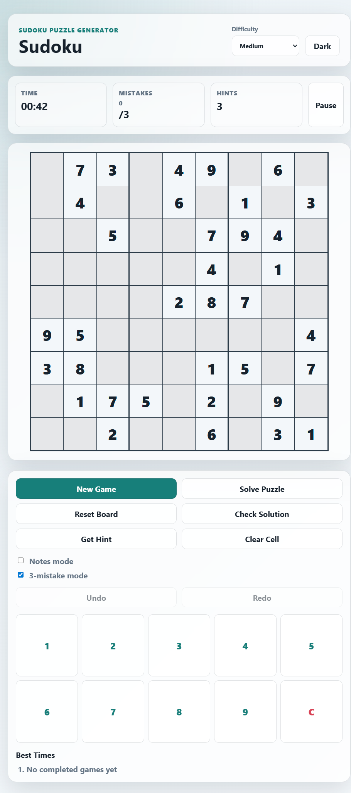
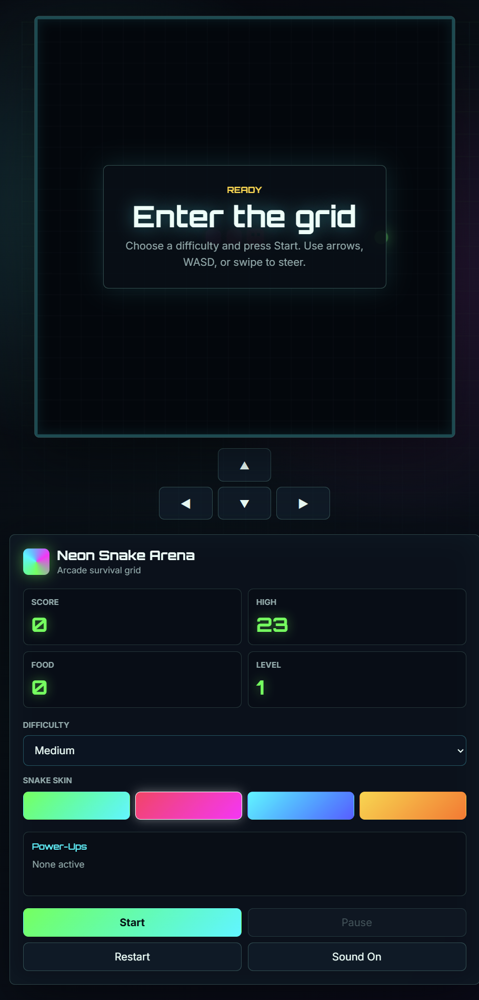
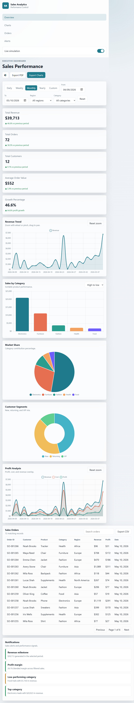
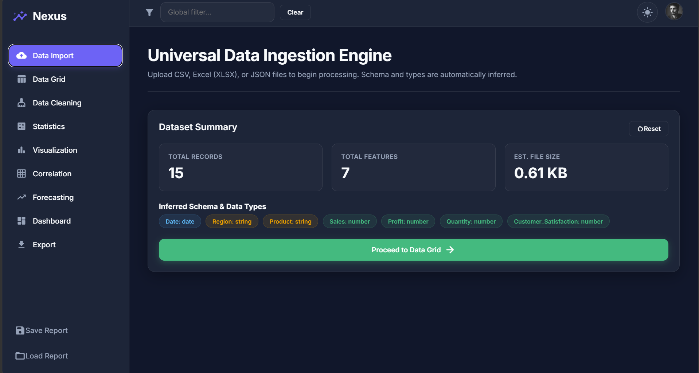
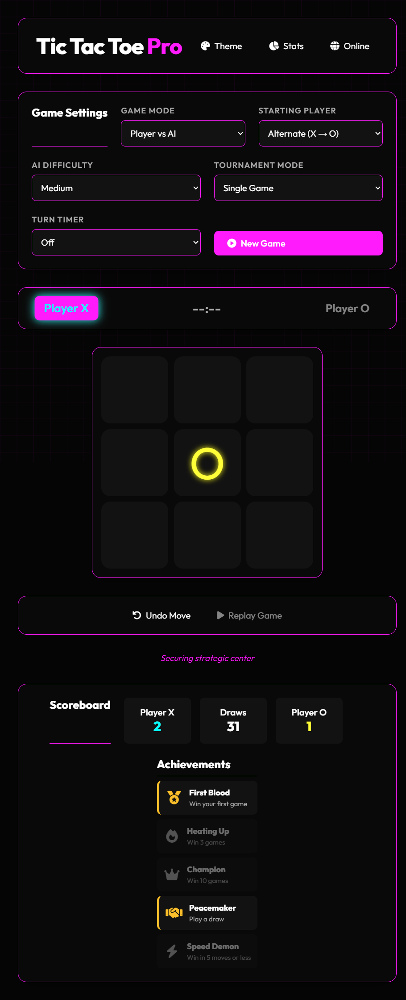

# 5 Task Challenge

This repository contains 5 frontend mini-projects built using **HTML, CSS, and JavaScript**.

## 📂 Projects Included

---

## 1. Sudoku Game

📁 Folder: `sudoku-game`

A Sudoku puzzle game where users solve number-based logic puzzles.

### Features:

* Interactive puzzle board
* Number validation
* Reset functionality

### Screenshot:



---

## 2. Snake Game

📁 Folder: `snake-game`

A classic snake game where the player controls the snake to collect food and grow.

### Features:

* Keyboard controls
* Score tracking
* Collision detection
* Game over logic

### Screenshot:



---

## 3. Dashboard

📁 Folder: `dashboard`

A responsive dashboard UI for displaying cards, widgets, and analytics.

### Features:

* Responsive layout
* Dashboard widgets
* Modern UI design

### Screenshot:



---

## 4. Data Analytics

📁 Folder: `data-analytics`

A simple analytics project that reads CSV data and displays insights.

### Features:

* CSV data handling
* Data visualization
* Analytics display

### Screenshot:



---

## 5. Tic Tac Toe Game

📁 Folder: `tic-tac-toe-game`

A two-player Tic Tac Toe game with winner detection.

### Features:

* Two-player gameplay
* Win/draw detection
* Restart game functionality

### Screenshot:



---

## 🛠 Technologies Used

* HTML5
* CSS3
* JavaScript

---

## 📁 Repository Structure

```text
5-task-challenge/
├── dashboard/
├── data-analytics/
├── snake-game/
├── sudoku-game/
├── tic-tac-toe-game/
└── screenshots/
```

## 🚀 Author

Created as part of the 5 Task Challenge project.
